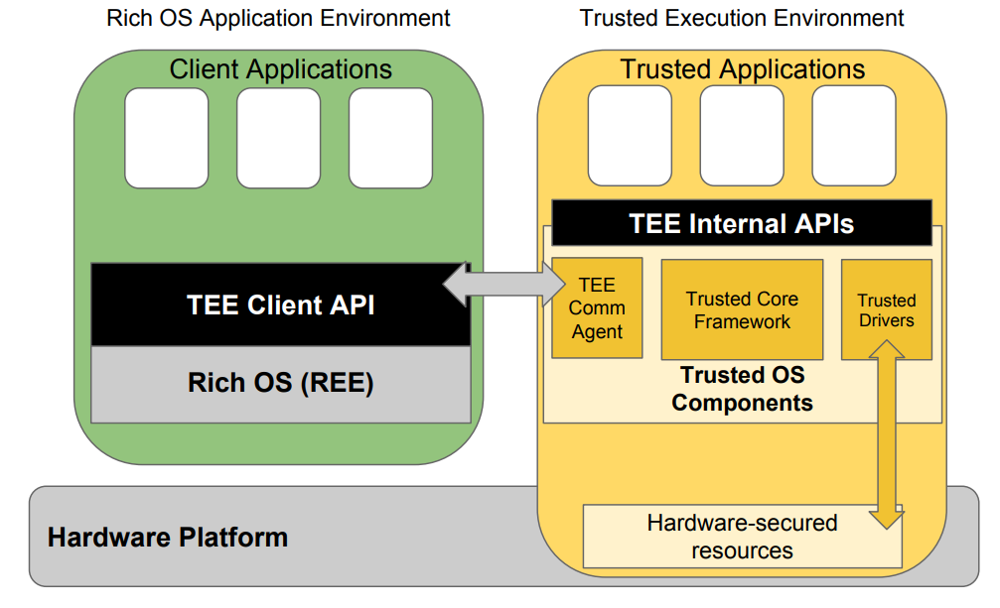

# Trusted Execution Environment (TEE)

**Code: https://github.com/fxlin/p3-tee** 

As well as any code that TA may distribute.

In this project, we will experience with Arm's TEE - TrustZone. 

Instead of writing baremetal TEE code, we will write our TEE code running atop a popular TEE framework -- OPTEE. 

## Objective

* (primary) experience with modern hardware-based isolation mechanism.
* (primary) security-oriented programming. 
* (primary) porting existing software to a new environment 
* (secondary) building embedded AI

## Overview

* [Quickstart](quickstart.md): set up the OPTEE development environment. You should follow the instructions. 
* [App examples](helloworld.md): demo two simple OPTEE apps which show basic app structures. You should reproduce the demo and tinker with the apps
* Porting libs to OPTEE: 
  * [Guidelines](porting.md)
  * [Case study: the SOD lib](sod.md)
* [Programming challenge](secure-vision.md): an assignment in which you will build a machine learning service inside TrustZone. *(cs4414/6456 students: refer to formal assignment)*

## Glossary
**TA** Trusted applications, sometimes called trustlets. A TA is a binary to be executed in the secure world. 

**CA** Trusted clients, or clients. A TA is a normal world apps invoking TAs. 

**TEE supplicant**: the OPTEE daemon running in the normal world serving clients 

**Host & guest** The lingo of OPTEE source refers the normal world app as "host". Be aware though: in the context of virtual machines, the PC/server where we hack & develop OPTEE code is "host" and QEMU is a "guest". We will be explicit in differentiating them. 

