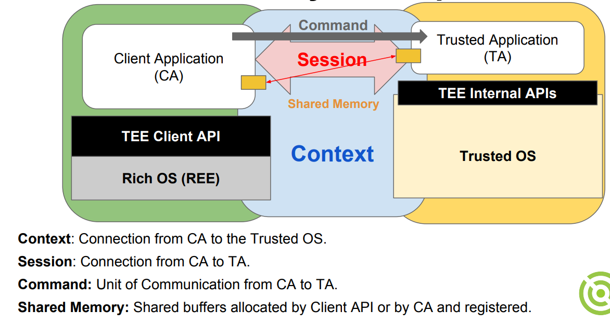
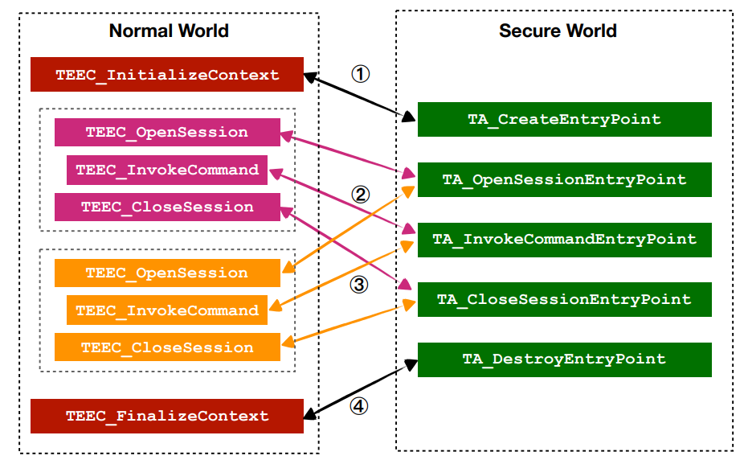

# Sample app code walkthrough

## Objective

We will walk through the source of two minimalist OPTEE apps. 

## Prerequisite

Having completed the [quickstart](quickstart.md). 

## App 1: Helloworld

What it does: the TA takes an integer value passed from the CA, increments the value by 1, and passes the value back to the CA. 

The code location is: `./optee_examples/hello_world/`. The directory structure is as follows: 
```
hello_world/
├── Android.mk
├── CMakeLists.txt
├── host
│   ├── main.c
│   └── Makefile
├── Makefile
└── ta
    ├── Android.mk
    ├── hello_world_ta.c
    ├── include
    │   └── hello_world_ta.h
    ├── Makefile
    ├── sub.mk
    └── user_ta_header_defines.h
```

For this tutorial, we only care about `host/main.c` (the client app) and `ta/*.[c|h]` (the TA). A detailed description of CA/TA source structure is [here](https://optee.readthedocs.io/en/latest/building/trusted_applications.html). 

### The CA/TA interaction




To implement the above interaction, CA/TA must implement a set of functions as shown below: 



### The CA (host) source

In only ~100 SLoC, the source implements a barebone CA. Corresponding to the figure above: 

First, initialize a TEE context: 
```c
int main(void) {
	/* ... */
	/* Initialize a context connecting us to the TEE */
	res = TEEC_InitializeContext(NULL, &ctx);
```
-------------------
Then, open a session to the TA: 
```c
res = TEEC_OpenSession(&ctx, &sess, &uuid,
			       TEEC_LOGIN_PUBLIC, NULL, NULL, &err_origin);
```
Here, `uuid` is worth explaining. Its value is assigned to be a magic number: 
```c
// main.c
TEEC_UUID uuid = TA_HELLO_WORLD_UUID; 
// hello_world_ta.h
#define TA_HELLO_WORLD_UUID \
	{ 0x8aaaf200, 0x2450, 0x11e4, \
		{ 0xab, 0xe2, 0x00, 0x02, 0xa5, 0xd5, 0xc5, 0x1b} }
```
This magic number uniquely identifies the TA. When we build the TA, the produced TA binary will be named after the UUID (e.g. 8aaaf200-2450-11e4-abe2-0002a5d5c51b.ta), instead of "helloworld.ta". 

-------------------

Next, prepare parameters for the cross-world call which invokes a TA command: 

```c
op.paramTypes = TEEC_PARAM_TYPES(TEEC_VALUE_INOUT, TEEC_NONE,
					 TEEC_NONE, TEEC_NONE);
op.params[0].value.a = 42;
```
A call can carry up to 4 parameters.  We are using the 0th argument only (TEEC_VALUE_INOUT, in/out, as a value). The remaining parameters are unused (TEEC_NONE). 

-------------------

Invoke the command: 
```c
TEEC_InvokeCommand(&sess, TA_HELLO_WORLD_CMD_INC_VALUE, &op,
				 &err_origin);
```
Note that `TA_HELLO_WORLD_CMD_INC_VALUE` is a command ID as agreed by CA/TA. It is defined in `hello_world_ta.h`. 

Under the hood, this will invoke `tee_supplicant`, which will go to the OPTEE kernel driver, which will request world switch (EL3), which will take the CPU to the secure world, which will invoke our TA.... and come back. 

-------------------

After the above function returns, we examine parameter 0, which should have been filled with a value incremented by the TA:

```
printf("TA incremented value to %d\n", op.params[0].value.a);
```

Then we are done with cleaning up: 

```
TEEC_CloseSession(&sess);
TEEC_FinalizeContext(&ctx);
```

As simple as that!

### The TA source

Another ~150 SLoC in `hello_world_ta.c`, which implements a set of callbacks, including: 

```
TEE_Result TA_CreateEntryPoint(void) {
	DMSG("has been called");
	return TEE_SUCCESS;
} 
void TA_DestroyEntryPoint(void) { 
	DMSG("has been called");
}
```
They will be invoked when the CA initializes/finalizes a context (again, check the figure above). DMSG() and IMSG() print debug messages to the secure world console. The visibility of such messages is controlled by TA's build macro `CFG_TEE_TA_LOG_LEVEL`in their respective Makefiles. 

When the CA opens/closes a session, the following TA functions will be called: 

```
TEE_Result TA_OpenSessionEntryPoint(...)
void TA_CloseSessionEntryPoint(...)
```

In this helloworld TA, they are just placeholders that print some "Hello world" messages, which shall show up on the secure world console. 

When the CA invokes a command, the TA will handle the command with the following "command entry point" function: 

```
TEE_Result TA_InvokeCommandEntryPoint(...)
```

This function further dispatches to `inc_value()` and `dec_value()`, depending on the command ID passed from the CA. These two functions will update the parameter (`params[0].value`) in place, which will be made visible to the CA after the command is completed on the normal world side. 

### Compile & run

See the setup guide. 

## App 2: Secure data path (sdp) basic 

Another simple example worth looking at. It showcases how to copy a large chunk of data between normal/secure worlds, as OPTEE does not support passing large data as values in command parameters (for efficiency reason).  

### The TA code 

is at ./optee_test/ta/sdp_basic/ta_sdp_basic.c. We focus on  three commands and their callbacks: `TA_SDP_BASIC_CMD_INJECT`, `TA_SDP_BASIC_CMD_TRANSFORM`, and `TA_SDP_BASIC_CMD_DUMP`. Check the source code comments which are informative. 

> The source code further include some commands for "Pseudo Trusted Application" (PTA) which can be learnt [here](https://optee.readthedocs.io/en/latest/architecture/trusted_applications.html). PTA is meant to be invoked by regular TAs, but not to be directly invoked by CAs in the normal world.

**Accessing shared buffer?** To implement the INJECT command, the TA accesses a shared memory buffer passed from the CA. This is only allowed when the TA is compiled with **TA_FLAG_SECURE_DATA_PATH**. Otherwise CA invoking the command will fail with "bad parameter" error (origin = 3, TEE). 

```c
//user_ta_header_defines.h
#define TA_FLAGS			(TA_FLAG_EXEC_DDR|TA_FLAG_SECURE_DATA_PATH) 
```

[Related discussion](https://github.com/OP-TEE/optee_os/issues/4572)

### The CA code

is at `./optee_test/host/xtest/sdp_basic.c`, from which you can learn how to prepare data buffer in the normal world to be copied to the secure world. Be aware: the code is part of a large test suite as opposed to a standalone user program. 

The entry function is `sdp_basic_runner_cmd_parser()` which will be invoked by the main test function in `./optee_test/host/xtest/xtest_main.c`. 

### Compile & run

See the setup guide. Make sure CFG_SECURE_DATA_PATH is set, which should have been taken care by env.sh already. 

Verify sdp functionalities are compiled: 

```
# on QEMU's normal world console
$ xtest -h |grep "sdp-basic"
--sdp-basic [opts] Basic Secure Data Path test setup ('-h' for usage)
```
Run the sdp example by: 
```
$ xtest --sdp-basic
# To get help 
$ xtest --sdp-basic -h
```


