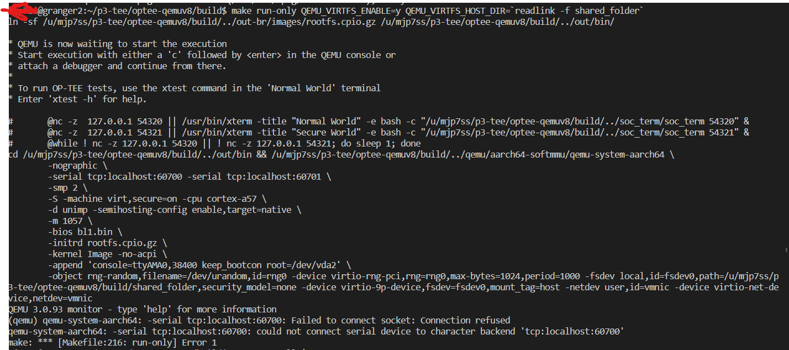

# Common issues

## (from normal world) optee_example_hello_world: TEEC_Opensession failed with code 0xffff0008 origin 0x3 
(from sec world): init_with_ldeff:232 ldelf failed with res: 0xffff0008 <--- meaning item no found

xtests all failed. 

meanwhile, the tee supplicant log: 
```
cat /data/tee/teec.log                      
ERR [190] TSUP:load_ta:284:   TA not found  
```
Related functions: tee_supplicant.c: TEECI_LoadSecureModule() and try_load_secure_module(). 

**Cause**: 
* Make sure all TAs are in place (/lib/optee_armtz/...)
* Make sure /lib/optee_armtz/ has right permission (755), allowing user "tee" to access. Otherwise TEE supplicant will fail. (THIS IS THE REASON)
```
xl6yq@granger2[optee-qemuv8]$ ll out-br/target/lib |grep optee_armtz
drwxr-xr-x 2 xl6yq fax   28 Apr  7 22:57 optee_armtz
```

**Solution**
build/br-ext/package/optee_examples/optee_examples.mk
add the chmod line
```
define OPTEE_EXAMPLES_INSTALL_TAS
        @$(foreach f,$(wildcard $(@D)/*/ta/out/*.ta), \
                mkdir -p $(TARGET_DIR)/lib/optee_armtz && \
                chmod 755 $(TARGET_DIR)/lib/optee_armtz && \
                $(INSTALL) -v -p  --mode=444 \
                        --target-directory=$(TARGET_DIR)/lib/optee_armtz $f \
                        &&) true
endef
```                

Related (but not our cause): https://github.com/mofanv/darknetz/issues/7

## (qemu) failed to launch


have you run the two 'nc' instances? are they still alive?


## (qemu) qemu-system-aarch64: Could not find ROM image 'bl1.bin'

arm-tf missing. Rebuild it. ``make arm-tf''.

##  (qemu) qemu-system-aarch64: failed to load "Image"
Kernel missing. 

## regression_1000.c:(.text+0x3300): undefined reference to `sdp_basic_test'
missing CFG_SECURE_DATA_PATH=y  in make command

## Failure to install dependencies of QEMU
If the installation fails, e.g. due to unmet dependency, it's likely that the source of your apt repository is not properly configured. A common cause is that you have previously installed packages from some third-party apt sources. Remove them from /etc/apt and do `apt update`. 

## shared_folder not found
`$ make run-only QEMU_VIRTFS_ENABLE=y QEMU_VIRTFS_HOST_DIR=build/shared_folder` 

If the above command complains "shared_folder" not found, try passing an absolute path as the last argument

## Include extra packages in rootfs? 

```
make buildroot QEMU_VIRTFS_ENABLE=y CFG_SECURE_DATA_PATH=y \
BR2_PACKAGE_BUSYBOX_SHOW_OTHERS=y \
CFG_TEE_RAM_VA_SIZE=0x00300000 -j`nproc`
```

## "No SOI" from SOD (secure world console)

meaning it fails to decode an image as .jpg. Can be benign if the image is not jpg, e.g. PNG.

## TEE failed to allocate ptes...

Secure world: "E/TC:0 alloc_pgt:281 5 page tables not available"

Cause: insufficient pgt cache for nw/sw shared memory. 

Solution: 

optee_os/core/arch/arm/include/mm.pgt_cache.h

`#define PGT_CACHE_SIZE 32`

https://github.com/OP-TEE/optee_os/issues/2178#issuecomment-374671101


## Failed to mount rootfs

A recent Linux kernel failed to mount the rootfs which is ext2. Related boot log: 

```
[    1.304029] uart-pl011 9000000.pl011: no DMA platform data                                                                                                                                            │····································[    1.309704] VFS: Cannot open root device "vda2" or unknown-block(0,0): error -6                                                                                                                       │····································[    1.310024] Please append a correct "root=" boot option; here are the available partitions:                                                                                                           │····································[    1.310863] 1f00           65536 mtdblock0                                                                                                                                                            │····································[    1.310980]  (driver?)                                                                                                                                                                                │····································[    1.311461] Kernel panic - not syncing: VFS: Unable to mount root fs on unknown-block(0,0)                                                                                                            │····································[    1.311933] CPU: 0 PID: 1 Comm: swapper/0 Not tainted 5.16.0-gdbeb6ea978fc #1                                                                                                                         │····································[    1.312256] Hardware name: QEMU QEMU Virtual Machine, BIOS 0.0.0 02/06/2015                                                                                                                           │····································[    1.312730] Call trace:                                                                                                                                                                               │····································[    1.312864]  dump_backtrace+0x0/0x1b0                                                                                                                                                                 │····································[    1.313196]  show_stack+0x18/0x68                                                                                                                                                                     │····································[    1.313358]  dump_stack_lvl+0x68/0x84                                                                                                                                                                 │····································[    1.313523]  dump_stack+0x18/0x34                                                                                                                                                                     │····································[    1.313663]  panic+0x164/0x324                                                                                                                                                                        │····································[    1.313793]  mount_block_root+0x130/0x20c                                                                                                                                                             │····································[    1.313953]  mount_root+0x1e0/0x214                                                                                                                                                                   │····································[    1.314091]  prepare_namespace+0x12c/0x16c                                                                                                                                                            │····································[    1.314340]  kernel_init_freeable+0x250/0x294                                                                                                                                                         │····································[    1.314621]  kernel_init+0x24/0x130                                                                                                                                                                   │····································[    1.314771]  ret_from_fork+0x10/0x20                                                                                                                                                                  │····································[    1.315194] SMP: stopping secondary CPUs                                                                                                                                                              │····································[    1.315679] Kernel Offset: 0x516c3b920000 from 0xffff800010000000                                                                                                                                     │·······························�····[    1.315912] PHYS_OFFSET: 0xffffdb4d00000000                                                                                                                                                           │····································[    1.316085] CPU features: 0x2,200018c2,00000846                                                                                                                                                       │····································[    1.316433] Memory Limit: none                                                                                                                                                                        │····································[    1.976015] ---[ end Kernel panic - not syncing: VFS: Unable to mount root fs on unknown-block(0,0) ]---
```

Kernel version: dbeb6ea97; 5.16.0

Strangely, the kernel config contains EXT2/3/4 as it should. No idea what caused the problem. 

Some students reported success when they repack rootfs as ext4

Note that `.repo/manifests/qemu_v8.xml` does not specify the release of Linux (as oppposed to other projects)

```
...
<!-- linaro-swg gits -->                                                                                                                         
<project path="linux"                name="linaro-swg/linux.git"                  revision="optee" clone-depth="1" />
```

So change that to an earlier version: 
```
<project path="linux"                name="linaro-swg/linux.git"                  revision="refs/tags/optee-3.10.0" clone-depth="1" />
```

Then `repo sync ...` you should be able to boot Linux fine. 


### Related dicussion:
* https://piazza.com/class/ky1ydg1ni7fty?cid=192
* https://piazza.com/class/ky1ydg1ni7fty?cid=190


### "bash: line 4: build: command not found" (while buiding edk2)
stale edk2 config. The root cause of almost all edk2 build problems
```
make edk2-cleaner
```
which basically does:

```
mv edk2/Conf/BuildEnv.sh edk2/Conf/BuildEnv.sh.old
make edk2-clean
```

### buildroot: ... external custom toolchain does not support SSP (stack protection)
Toolchain problem. test program for SSP failed to build. make sure toolchains/ are good, e.g. crt0.o must be there. 
rename or remove toolchains/, then
```
make toolchains -j2
```


### other buildroot failures
If it's "host" packages, check versions of server libraries, toolchains, etc. 
Otherwise check the cross compiler toolchain. 

### qemu make clean failure

#### symptom
```
xl6yq@granger2 (master)[qemu]$ make distclean
/bin/sh: 1: cd: can't cd to /home/xzl/p3/optee-qemuv8-teachingonly/optee-qemuv8/qemu
find: ‘/home/xzl/p3/optee-qemuv8-teachingonly/optee-qemuv8/qemu/scripts/tracetool’: No such file or directory
```

cause: config-host.mak constains stale paths, which causes ``make distclean`` to fail. (make distclean is supposed to clean up config-host.mak!)

solution: 
```
mv config-host.mak /tmp
```

### -j20 seems ignored for some modules (edk2, buildroot)
TBD

### ln: target '/u/xl6yq/tmp/optee-qemuv8/build/../out/bin/' is not a directory: No such file or directory
likely some targets failed to build (otherwise they will produce symlinks such as bl1.bin etc under out/bin)

```                                                                                             
cd build                                                                                        
make QEMU_VIRTFS_ENABLE=y CFG_SECURE_DATA_PATH=y CFG_TEE_RAM_VA_SIZE=0x00300000 arm-tf -j20     
make QEMU_VIRTFS_ENABLE=y CFG_SECURE_DATA_PATH=y CFG_TEE_RAM_VA_SIZE=0x00300000 buildroot -j20  
make QEMU_VIRTFS_ENABLE=y CFG_SECURE_DATA_PATH=y CFG_TEE_RAM_VA_SIZE=0x00300000 linux -j20      
```
See which target fails and the error messages. 

### edk2:  error F002: Failed to build module .... FileExplorerLib/FileExplorerLib.inf
Per the error message, do something like: 
```
make -C optee-qemuv8/build/../edk2/BaseTools/Source/C
```

### no symlinks (e.g. bl1.bin) under out/bin/ after a full `make`

See if this helps: force building the arm-tf target, which is responsible for those links...

```
make QEMU_VIRTFS_ENABLE=y CFG_SECURE_DATA_PATH=y CFG_TEE_RAM_VA_SIZE=0x00300000 -j20 arm-tf
```

### (qemu) qemu-system-aarch64: -serial tcp:localhost:50324: Failed to connect socket: Connection refused
Make sure two "nc" commands are running. Check the port numbers

### (qemu) qemu-system-aarch64: failed to load "rootfs.cpio.gz"
do you have rootfs.cpio.gz under out-br/images/? If not, ``make buildroot`` seems incomplete or fail. Try build it. 

### buildroot: "You seem to have the current working directory in your LD_LIBRARY_PATH environment variable. This doesn't work."
```
export LD_LIBRARY_PATH=
# make sure nothing
echo $LD_LIBRARY_PATH
```

### (qemu) qemu-system-aarch64: failed to load "Image"
Linux kernel missing. Likely not built or linked. See out/bin/Image. If missing, force build:
```
make QEMU_VIRTFS_ENABLE=y CFG_SECURE_DATA_PATH=y CFG_TEE_RAM_VA_SIZE=0x00300000 -j20 linux
```

### Linux build asks for configuration 
Simply accept all default ones. 

### buildroot: "/home/bfr4xr/optee-qemuv8/build/../toolchains/aarch64/bin/aarch64-linux-gnu-ld.bfd: cannot find -los_test"
Need a dirty hack: 
```bash
cd out-br/build/optee_test-1.0/ta
ln -sf os_test_lib 0os_test_lib
```
Then ``make buildroot...``

Explanation: optee_test-1.0 has a bunch of CAs/TAs, including os_test, which depends on os_test_lib. 
For a reson that is beyond me, the dependency is not encoded in the build system. Instead, it seems to count on luck that shell enumerates 
os_test_lib before os_test and builds the former first. 
Apparently, on a shell that enumerates os_test before os_test_lib, the build will fail. 
Solution: force the shell to discover os_test_lib first...

### make edk2-clean: python complains lack of "UserDict"
It is a Python2 thing. Some edk2 library expects python2. Make sure you have it. It is ok that the default python is python3.

## ModuleNotFoundError: No module named 'Crypto'
It's a python script complaining you don't have Crypto. To see if that's the case, do 
`python -c "import Crypto"`
There shouldn't be any error. Solution: 
`sudo apt get install python-is-python3`; then `sudo apt get install python3-pycrypto` to install Crypto for python3; lastly `sudo apt install python-crypto` to install it for python2. All needs to be done with `root`.
