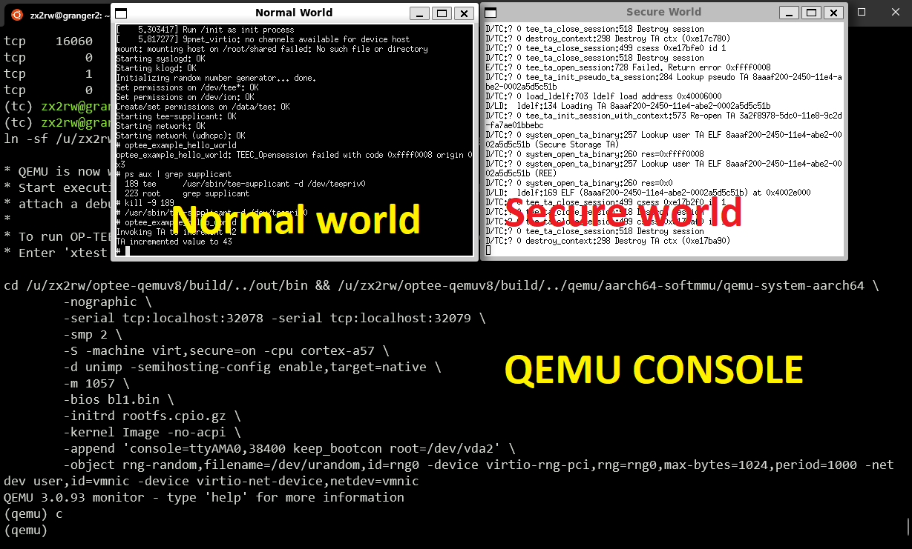
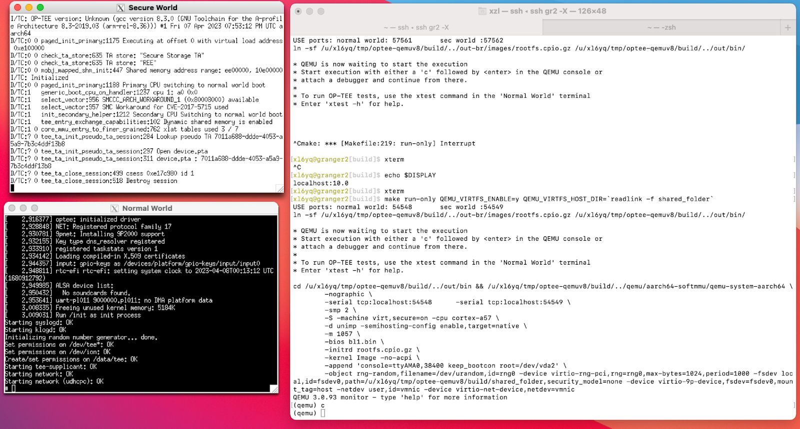

# Quickstart: OPTEE 

NEW: Sp23 CS4414. We provide a source tarball for all. 

**This project is to be completed on servers; or your own Linux/Windows box; or rpi3**

## Source code overview

Compared to the codebase we have dealt with before, OPTEE is a complex project with a myriad of components, including QEMU, a normal world daemon, trustlets (TAs), etc. The sources of all these components are organized in a directory with the following structure. 

```
($optee ROOT)
├── build (this is where we execute the build command)
	├── shared_folder/ (will be shared with the QEMU)
	├── (other artifacts)
├── buildroot
├── edk2 (a firmware SDK)
├── linux
├── mbedtls
├── optee_benchmark
├── optee_client
├── optee_examples
├── optee_os
├── optee_test
├── out
├── out-br (the build outcome)
├── qemu (a qemu version with TrustZone support)
├── soc_term
├── toolchains
└── trusted-firmware-a
```

The build process is complex. It is managed by numerous Makefiles in a hierarchy; it also builds for various Arm boards and QEMU (called "targets''). To automate the build process, there is a dedicated component called `build` (see above), which has its own git repository. 

## Building the entire project: an overview

1. Grab the source code:
        1. Access the tarball (optee-qemuv8-students-MMDDYY.tar) from /home/students/ on granger1/2. Don't need to copy to your home dir. Directly untar it like ```cd ~/; tar xvf /home/students/optee-qemuv8-students.tar```.
        2. If you use own machine, you can download the tarball over SSH.        
2. First time build: we will build everything including QEMU and normal/secure worlds binaries of OPTEE. The build process will pack these binaries into an OS image (rootfs image) to be launched by QEMU
3. Run QEMU and play with "Hello world", validating that our environment works properly.
4. Repeated build: modify source code of normal world app and TAs, and build again. 

## Setup steps

Most students may develop an ARM platform with TrustZone as emulated by QEMU. For students who want to use real hardware (Rpi3), see [here](quickstart-rpi3.md). 

**DO NOT REUSE QEMU FROM P1. MUST BUILD FROM SOURCE CODE.**

### Step 1: Prep personal machine

(Below, "owner" == you have a local machine with admin access)

(Below: unsupported == it may work; but course staff cannot provide support)

#### 1.1. Make your choice:

1. **Local build choice: (Recommended for Win/Linux owners)**. Linux or Windows (WSL); must run Ubuntu 20.04; 50GB disk space. Pros: code builds fast; nice xterm. 
1. **Remote build choice: (possible to Win/Linux/Mac)**. Personal machine connected to course servers; build everything on servers. 

#### 1.2 Install Software 

* **Win owner.** Install WSL2 ([instructions)](wsl-ubuntu-howto.md). 
  * Local build choice: Install software [here](quickstart-req.md).
  * Remote build choice: WSL2 with Ubuntu >= 20.04. Other distro/version: unsupported. 
* **Linux owner**: 
  * Local build choice: Install software [here](quickstart-req.md).
  * Remote build choice: Just make sure you have a local X desktop. 
* **Mac owner**
  * Remote build choice. Install & configure X server. [instructions](https://docs.google.com/document/d/1MVOJzVWuJeYznnzXg1C6Pe6bLi1KlmXik2FiPB1mKlE/edit?usp=sharing)


### Step 2: build OP-TEE for QEMU

The following instructions assume `${OPTEE}` to be the top directory, e.g. `~/optee_qemuv8` 

```bash
$ cd ${OPTEE}
$ source env.sh  # will load commands, gen random ports, etc.
```

Build OPTEE for QEMU ARMv8: 

```sh
$ cd ${OPTEE}/build
# clean build: about 5 minutes on a 20-core machine. Can be longer if other users exist
$ make QEMU_VIRTFS_ENABLE=y CFG_SECURE_DATA_PATH=y CFG_TEE_RAM_VA_SIZE=0x00300000 -j`nproc`
```

**Explanation**: QEMU_VIRTFS_ENABLE allows QEMU and the host (e.g. granger1) to share files; CFG_SECURE_DATA_PATH builds in the support for data copy between two worlds; CFG_TEE_RAM_VA_SIZE sets the virtual address range for TEE; -j`nproc` asks to use all cores for making. 

If you want to clean up existing build, do `make clean` under `build/`. `make cleaner` further cleans up configuration files. 

### Step 3: run OPTEE

```sh
cd build
make run-only QEMU_VIRTFS_ENABLE=y QEMU_VIRTFS_HOST_DIR=`readlink -f shared_folder`
```

Explanation: QEMU_VIRTFS_HOST_DIR means the emulated OS and granger1/2 will share a directory. Easy for file exchange. 

QEMU must be launched without errors. See [troubleshooting](issues.md).

Start the emulation: typing `c` in the GDB command window. There might be delay of 1-2 secs because of the Internet communication, but the overall experience is good.

##### Troubleshoot

If the port is already in use, "make run-only" just hangs (I guess xterm hangs) with no output, unlike `nc` which tells you "Address aready in use". If that happens, use `netstat` to verify and try an unused one. 

### Results

WSL2: 



Mac: 




### If you cannot get local X server to work

Run nc on server. See [quickstart-nc.md](quickstart-nc.md).

## Test apps

Verify that OPTEE's normal-world daemon (`tee_supplicant`) is already started automatically as a service.
```bash
# In the normal world console: 
$ ps aux|grep supplicant
 190 tee      /usr/sbin/tee-supplicant -d /dev/teepriv0b
```

Run OPTEE's test suite (`xtest`), which should have already been baked in the rootfs image in the build process: 

```bash
# In the normal world console: 
$ which xtest
/usr/bin/xtest
$ xtest
(output...)
```
For more options for `xtest`, see its [reference](https://optee.readthedocs.io/en/latest/building/gits/optee_test.html#optee-test-run-xtest)

Now try examples for OPTEE, e.g. 

```bash
#  In the normal world console: 
$ optee_example_hello_world
Invoking TA to increment 42
TA incremented value to 43
```

Reference: [Official build instructions](https://optee.readthedocs.io/en/latest/building/gits/build.html#root-fs)

## Development workflow

### Choice 1: easier to set up (but need to reboot QEMU every time)

We will leverage an existing OPTEE example program: modify/add/delete its sources, rebuild the entire rootfs, and relaunch QEMU. In this way, we do not have deal with the Makefile hierarchy. 

We pick the "helloworld" example. Here's its source directory: 

``` bash
$ tree ./optee_examples/hello_world/
hello_world/
├── Android.mk
├── CMakeLists.txt
├── host (the normal world)
│   ├── main.c
│   └── Makefile
├── Makefile
└── ta (the secure world)
    ├── Android.mk
    ├── hello_world_ta.c
    ├── include
    │   └── hello_world_ta.h
    ├── Makefile
    ├── sub.mk
    └── user_ta_header_defines.h
3 directories, 11 files

```

#### CA (the normal world): 

Let's do some trivial changes to the helloworld app source: 

./optee_examples/hello_world/host/main.c

```c
@@ -82,7 +82,7 @@ int main(void)
         * TA_HELLO_WORLD_CMD_INC_VALUE is the actual function in the TA to be
         * called.
         */
-       printf("Invoking TA to increment %d\n", op.params[0].value.a);
+       printf("hello! ... Invoking TA to increment %d\n", op.params[0].value.a);
+       
```

Then rebulid hello world: 
```bash
# on dev machine:
$ cd ${OPTEE}/build    
$ make buildroot QEMU_VIRTFS_ENABLE=y CFG_SECURE_DATA_PATH=y CFG_TEE_RAM_VA_SIZE=0x00300000 -j`nproc`
```
Explanation: the "buildroot" target is for the entire filesystem, including CA/TA programs within. Note that `make optee-examples-common` seems obsoleted. See [discussion](https://github.com/OP-TEE/build/issues/282).

Output location: `./out-br/target/usr/bin/optee_example_hello_world`

Restart QEMU and invoke the CA  from within QEMU, showing that our modification is effective: 

```bash
# (in the normal world console)
$ optee_example_hello_world
hello! ... Invoking TA to increment 42
TA incremented value to 43
```

#### TA (the secure world)
Source location: `./optee_examples/hello_world/ta/hello_world_ta.c` 

Do some trivial changes: 

```c
@@ -108,7 +108,8 @@ static TEE_Result inc_value(uint32_t param_types,
                return TEE_ERROR_BAD_PARAMETERS;

        IMSG("Got value: %u from NW", params[0].value.a);
-       params[0].value.a++;
+       params[0].value.a+=2;
        IMSG("Increase value to: %u", params[0].value.a);
```

Build: 
```bash
# On dev machine
$ cd ${OPTEE}/build    
$ make buildroot QEMU_VIRTFS_ENABLE=y CFG_SECURE_DATA_PATH=y CFG_TEE_RAM_VA_SIZE=0x00300000 -j`nproc`
```

Check the build outcome: 
```bash
# on dev machine
# cd ${OPTEE}
$ ls -lh out-br/target/lib/optee_armtz/8aaaf200-2450-11e4-abe2-0002a5d5c51b.ta
-r--r--r-- 1 xzl xzl 55K Jul 10 09:56 out-br/target/lib/optee_armtz/8aaaf200-2450-11e4-abe2-0002a5d5c51b.ta

$ md5sum out-br/target/lib/optee_armtz/8aaaf200-2450-11e4-abe2-0002a5d5c51b.ta
669e219e7381c842d80f3ba68db9368f  out-br/target/lib/optee_armtz/8aaaf200-2450-11e4-abe2-0002a5d5c51b.ta
```
Why the magical filename? This is because each TA is named after a unique UUID. In this example, it is defined in `hello_world_ta.h`. The build script will pick the UUID up and name the output binary after it. 

Restart QEMU, and check if the newly build TA is baked into our rootfs: 

```bash
# (In the normal world console): 
$ md5sum /lib/optee_armtz/8aaaf200-2450-11e4-abe2-0002a5d5c51b.ta
669e219e7381c842d80f3ba68db9368f
```

The md5sum (669e2...) matches what we saw above. 

Now run helloworld again: 

```bash
# (in the normal world console)
$ optee_example_hello_world
hello! ... Invoking TA to increment 42
TA incremented value to 44
```

The value is incremented by 2 -- our modification to TA works!

### Choice 2: shared binaries with QEMU, no reboot needed

With the above method, you will soon find it tedious to restart QEMU every time we change TA/CA sources. The solution is to share the TA/CA build outcome via a folder shared with the QEMU guest.

On the development machine, from the root of OPTEE source code: 

```sh
$ mkdir build/shared_folder
```
When we build & launch QEMU, pass in "VIRTFS" (virtual filesystem) arguments: 
```bash
$ make run-only QEMU_VIRTFS_ENABLE=y QEMU_VIRTFS_HOST_DIR=build/shared_folder
```
After QEMU is launched, mount the shared folder in QEMU guest system (username: root).

```sh
# (in the normal world console)
# this creates /root/shared/ which will be mapped to the host's build/shared_folder
$ mkdir shared && mount -t 9p -o trans=virtio host shared
```

**To rebuild a CA:** Every time we rebuild a CA (see the command above `make buildroot...`), copy its binary to the shared directory: 

```bash
$ cp ./out-br/target/usr/bin/optee_example_hello_world build/shared_folder/
```

**To rebuilt a TA:** If we rebuild a TA, first copy TAs to the shared directory (similar to above); then in the normal world console, copy the TAs to the guest's `/lib` where OPTEE's daemon will look for TAs: 

```sh
# (in the normal world console) 
$ cd shared && cp *.ta /lib/optee_armtz/
```
You are recommended to write a script to automate the above workflow. 

**Need extra software packages (e.g. strace)** to be included in the rootfs image? Change `build/common.mk`. To see what packages are available & selected, check out file `out-br/.config`. See [here](https://github.com/OP-TEE/optee_os/issues/2632). 

### Choice 3: Rpi3 - copying files over SSH

If we are running Rpi3, we copy over CA/TA over SSH connection. [This article](https://github.com/piachristel/open-source-fabric-optee-chaincode/blob/master/documentation/chaincode-and-chaincode-proxy-rapi.md) explains how to quickly configure an SSH server on Rpi3. 
