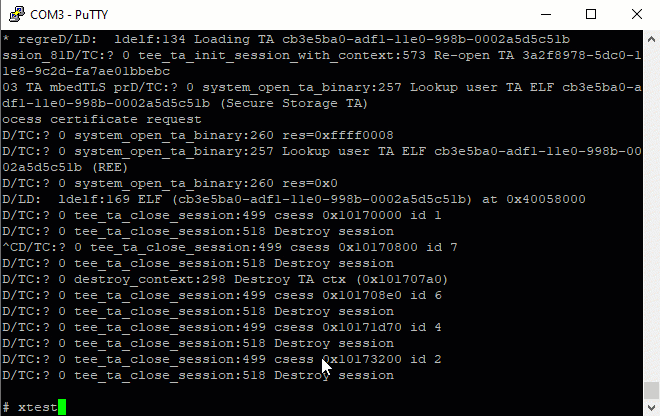

# Quickstart: OPTEE 

NEW: Sp23 CS4414. We provide a source tarball for all. 

**This project is to be completed on granger1/2; or your own Linux/Windows box; or rpi3**

## Source code overview

Compared to the codebase we have dealt with before, OPTEE is a complex project with a myriad of components, including QEMU, a normal world daemon, trustlets (TAs), etc. The sources of all these components are organized in a directory with the following structure. 

```
($optee ROOT)
├── build (this is where we execute the build command)
	├── shared_folder/ (will be shared with the QEMU)
	├── (other artifacts)
├── buildroot
├── edk2 (a firmware SDK)
├── linux
├── mbedtls
├── optee_benchmark
├── optee_client
├── optee_examples
├── optee_os
├── optee_test
├── out
├── out-br (the build outcome)
├── qemu (a qemu version with TrustZone support)
├── soc_term
├── toolchains
└── trusted-firmware-a
```

The build process is complex. It is managed by numerous Makefiles in a hierarchy; it also builds for various Arm boards and QEMU (called "targets''). To automate the build process, there is a dedicated component called `build` (see above), which has its own git repository. 

## Building the entire project: an overview

1. Grab the source code:
        1. Access the tarball (optee-qemuv8-students-MMDDYY.tar) from /home/students/ on granger1/2. Don't need to copy to your home dir. Directly untar it like ```cd ~/; tar xvf /home/students/optee-qemuv8-students.tar```.
        2. If you use own machine, you can download the tarball over SSH.        
2. First time build: we will build everything including QEMU and normal/secure worlds binaries of OPTEE. The build process will pack these binaries into an OS image (rootfs image) to be launched by QEMU
3. Run QEMU and play with "Hello world", validating that our environment works properly.
4. Repeated build: modify source code of normal world app and TAs, and build again. 

## Setup steps

You can choose one of two possible environments: an ARM platform with TrustZone as emulated by QEMU; Rpi3 which has TrustZone built in. 

### Environment choice 1: QEMU

**DO NOT REUSE QEMU FROM P1. YOU MUST BUILD IT FROM SOURCE CODE.***

To run examples on the QEMU ARMv8 emulator, we need first build OP-TEE for QEMU that emulates ARMv8 and TrustZone. 

Recommended options:

1. granger1/2. 
1. You own Linux or Windows box also works. Code builds faster than granger1/2. And you also have nice xterm. It must run Ubuntu 20.04. See [WSL](wsl-ubuntu-howto.md) and 
package dependencies [instruction](https://optee.readthedocs.io/en/latest/building/prerequisites.html). You also need ``sudo apt install python3-pycryptodome python-is-python3 python2``.

The following instructions assume `${OPTEE}` to be the top directory, e.g. `~/optee_qemuv8` 

Build OPTEE for QEMU ARMv8: 

```sh
$ cd ${OPTEE}/build
# clean build: about 5 minutes on a 20-core machine
$ make QEMU_VIRTFS_ENABLE=y CFG_SECURE_DATA_PATH=y CFG_TEE_RAM_VA_SIZE=0x00300000 -j`nproc`
```

**Explanation**: QEMU_VIRTFS_ENABLE allows QEMU and the host (e.g. granger1) to share files; CFG_SECURE_DATA_PATH builds in the support for data copy between two worlds; CFG_TEE_RAM_VA_SIZE sets the virtual address range for TEE; -j`nproc` asks to use all cores for making. 

If you want to clean up existing build, do `make clean` under `build/`. `make cleaner` further cleans up configuration files. 

#### Adjust the makefile  `build/qemu_v8.mk`

Find the following lines: 
```bash
run-only:
	ln -sf $(ROOT)/out-br/images/rootfs.cpio.gz $(BINARIES_PATH)/
	$(call check-terminal)
	$(call run-help)
	# $(call launch-terminal,54320,"Normal World")
	# $(call launch-terminal,54321,"Secure World")
	# $(call wait-for-ports,54320,54321)
	cd $(BINARIES_PATH) && $(QEMU_PATH)/aarch64-softmmu/qemu-system-aarch64 \
		-nographic \
		-serial tcp:localhost:50324 -serial tcp:localhost:50323 \
		-smp $(QEMU_SMP) \
		-S -machine virt,secure=on -cpu cortex-a57 \
		-d unimp -semihosting-config enable,target=native \
		-m 1057 \
		-bios bl1.bin \
		-initrd rootfs.cpio.gz \
		-kernel Image -no-acpi \
		-append 'console=ttyAMA0,38400 keep_bootcon root=/dev/vda2' \
		$(QEMU_EXTRA_ARGS)
```

The line `-serial tcp:localhost:50324 -serial tcp:localhost:50323` tells QEMU to listen on two ports for incoming GDB connection. 
THE TWO PORTS MUST BE CHANGED to your choice (e.g. 58888/59999): if multiple students bind to the same ports, all but one will fail. 

**Check if a port is in use** `netstat --all | grep 54320` (port 54320)
#### Run netcat (nc)

Run two `nc` to listen port `50324` and `50323`, which connect to consoles for normal & secure worlds of the ARM system emulated by QEMU, respectively. 

```bash
$ nc -l 127.0.0.1 50324
```

ON A DIFFERENT TERMINAL: 
```bash
$ nc -l 127.0.0.1 50323
```

NOTE on nc: 

1. nc has slight variations in its command line syntax. If you run into issues, see [here](https://serverfault.com/questions/512333/how-can-i-configure-netcat-or-some-other-stock-linux-utility-to-listen-on-a-sp). 
1. nc terminates whenever you exit QEMU. If you nc to restart automatically to be ready for the next QEMU launch:

```bash
$ while true; do nc -l 127.0.0.1 50324; done
```

#### Run QEMU

YOU MUST HAVE THE TWO nc instances running already. 

```sh
cd build
make run-only QEMU_VIRTFS_ENABLE=y QEMU_VIRTFS_HOST_DIR=`readlink -f shared_folder`
```

Explanation: QEMU_VIRTFS_HOST_DIR means the emulated OS and granger1/2 will share a directory. Easy for file exchange. 

QEMU must be launched without errors. Also see [troubleshooting](issues.md).

Start the emulated guest by typing `c`.

#### Results

Here is my window (running tmux) split in three ways: 


That's it!

#### (Optional) Xterm Addon

In the previous way, the normal and secure world terminals are launched inside QEMU. We can instead launch Xterms and forward them to our local machine. It's not necessary but looks cooler and provides a little more functionality. The setup steps are as follows.

##### Enable X11 forwarding on the server's `sshd` (this steps is done by instructor/TA)

Open `/etc/ssh/sshd_config` with root, add `X11Forwarding yes` to this file if it's not there, and lastly restart `sshd` with `sudo systemctl restart ssh`.

##### Enable X11 forwarding on the client

Login the server with `ssh -X user@ip`, i.e., adding the `-X` option to your usual login command. You can also consider adding `ForwardX11 yes` to ssh config file `~/.ssh/config` so that you don't need the extra `-X` option every time.

##### Set `DISPLAY` variable on the server

Once you login the server using `ssh -X ...`, run `export DISPLAY=localhost:10.0` in the server terminal. This will tell the server which display to go to when Xterm launches. You can add it to your bash config file `~/.bashrc` to skip the manual execution.

##### Modify Makefile

The last step is to modify `qemu_v8.mk` so it launches the two terminals automatically. In the guide above, we comment out the lines to launch and wait for terminals `(call launch-terminal)`. We'll restore them here. The corresponding region becomes:

```bash
run-only:
	ln -sf $(ROOT)/out-br/images/rootfs.cpio.gz $(BINARIES_PATH)/
	$(call check-terminal)
	$(call run-help)
	$(call launch-terminal,50323,"Normal World") # uncomment this line and use the port # of normal world
	$(call launch-terminal,50324,"Secure World") # uncomment this line and use the port # of secure world
	$(call wait-for-ports,50324,50323)	     # uncomment this line and let xterm waits for output
	cd $(BINARIES_PATH) && $(QEMU_PATH)/aarch64-softmmu/qemu-system-aarch64 \
		-nographic \
		-serial tcp:localhost:50324 -serial tcp:localhost:50323 \ # make sure to use the ports you choose here
		-smp $(QEMU_SMP) \
		-S -machine virt,secure=on -cpu cortex-a57 \
		-d unimp -semihosting-config enable,target=native \
		-m 1057 \
		-bios bl1.bin \
		-initrd rootfs.cpio.gz \
		-kernel Image -no-acpi \
		-append 'console=ttyAMA0,38400 keep_bootcon root=/dev/vda2' \
		$(QEMU_EXTRA_ARGS)
```
Make sure you change all the port numbers in two `call launch-terminal` and `call wait-for-ports` to those you choose in `-serial tcp:localhost:50324 -serial tcp:localhost:50323`.

##### Run QEMU

Run QEMU with exactly the same commad, but no `nc` is needed since the terminals launch on your local machine. There might be delays because of the Internet communication, but the overall experience is good.

##### Troubleshoot

If the port is already in use, "make run-only" just hangs (I guess xterm hangs) with no output, unlike `nc` which tells you "Address aready in use". If that happens, use `netstat` to verify and try an unused one. 

##### Result

The screenshot below shows the end result on Windows with `ssh` client `OpenSSH_for_Windows_8.1p1, LibreSSL 3.0.2`. No separate xserver installation is required to make it work.


### Environment choice 2: Rpi3 hardware

Read the instructions for QEMU above. We will follow a similar procedure with minor tweaks. 

**Grab source.** Note that we point to `rpi3.xml` instead of `qemu_v8.xml`: 

```sh
$ mkdir -p ~/bin
$ curl https://storage.googleapis.com/git-repo-downloads/repo > ~/bin/repo && chmod a+x ~/bin/repo
$ export PATH=~/bin:$PATH
$ mkdir optee-rpi3 && cd optee-rpi3 && \
  repo init -q -u https://github.com/OP-TEE/manifest.git -m rpi3.xml -b 3.9.0 && \
  repo sync -j4 --no-clone-bundle
```

**Build:** 

```bash
$ cd build
$ make -j2 toolchains
$ make -j`nproc` # note we don't need flags for VIRTFS, etc.
```

The build output will be `out-br/images/rootfs` which is the filesystem tree (and image) for Rpi3. 

**Prepare the SD card:**

In the following steps, we will load the filesystem tree to a microSD card. OPTEE's [instructions](https://optee.readthedocs.io/en/latest/building/devices/rpi3.html) for Rpi3 suggest you to go `build/` and run `make img-help` to see the list of commands. Here is a [sample output](../rpi3-flash-sample-cmd.txt) from my computer; you should follow the commands displayed when you rum `make img-help` on your computer. 

These commands are nothing magical: 

i) format a microSD card from scratch. The commands use `fdisk` to create two partitions: boot (32MB, FAT32) and rootfs (spanning the rest of the microSD card, ext4). 

ii) load the filesystem image to the card. The commands extract boot/ and / from the filesystem image (*.cpio) to the two partitions of the microSD card, respectively. 

**Note:** these commands assume that you have a local Linux machine, to which you can plug in the micro SD card (via a card reader) and partition it. What if you only have a Windows or Mac machine? I think you can use WSL/Win32DiskImager for the former and diskutil on the latter. Some ref [here](https://www.raspberrypi.org/documentation/installation/installing-images/mac.md). I haven't tried either. You can tell me your findings. 

**Boot Rpi3 from the micro SD card:**

Power on Rpi3 and hook up a serial cable. We boot into a Linux console (root, empty password) from a serial console: 


Then we can validate that OPTEE works by running the xtest suite. Hooray! :grin:

Note: Both the normal and the secure worlds share the same console. Secure world has higher privilege and its output will overwrite that of the normal world. 



Reference: [here](https://github.com/piachristel/open-source-fabric-optee-chaincode/blob/master/documentation/chaincode-and-chaincode-proxy-rapi.md) and [here](https://optee.readthedocs.io/en/latest/building/gits/build.html)

## Test apps

Verify that OPTEE's normal-world daemon (`tee_supplicant`) is already started automatically as a service.
```bash
# In the normal world console: 
$ ps aux|grep supplicant
 190 tee      /usr/sbin/tee-supplicant -d /dev/teepriv0b
```

Run OPTEE's test suite (`xtest`), which should have already been baked in the rootfs image in the build process: 

```bash
# In the normal world console: 
$ which xtest
/usr/bin/xtest
$ xtest
(output...)
```
For more options for `xtest`, see its [reference](https://optee.readthedocs.io/en/latest/building/gits/optee_test.html#optee-test-run-xtest)

Now try examples for OPTEE, e.g. 

```bash
#  In the normal world console: 
$ optee_example_hello_world
Invoking TA to increment 42
TA incremented value to 43
```

Reference: [Official build instructions](https://optee.readthedocs.io/en/latest/building/gits/build.html#root-fs)

## Development workflow

### Choice 1: easier to set up (but need to reboot QEMU every time)

We will leverage an existing OPTEE example program: modify/add/delete its sources, rebuild the entire rootfs, and relaunch QEMU. In this way, we do not have deal with the Makefile hierarchy. 

We pick the "helloworld" example. Here's its source directory: 

``` bash
$ tree ./optee_examples/hello_world/
hello_world/
├── Android.mk
├── CMakeLists.txt
├── host (the normal world)
│   ├── main.c
│   └── Makefile
├── Makefile
└── ta (the secure world)
    ├── Android.mk
    ├── hello_world_ta.c
    ├── include
    │   └── hello_world_ta.h
    ├── Makefile
    ├── sub.mk
    └── user_ta_header_defines.h
3 directories, 11 files

```

#### CA (the normal world): 

Let's do some trivial changes to the helloworld app source: 

./optee_examples/hello_world/host/main.c

```c
@@ -82,7 +82,7 @@ int main(void)
         * TA_HELLO_WORLD_CMD_INC_VALUE is the actual function in the TA to be
         * called.
         */
-       printf("Invoking TA to increment %d\n", op.params[0].value.a);
+       printf("hello! ... Invoking TA to increment %d\n", op.params[0].value.a);
+       
```

Then rebulid hello world: 
```bash
# on dev machine:
$ cd ${OPTEE}/build    
$ make buildroot QEMU_VIRTFS_ENABLE=y CFG_SECURE_DATA_PATH=y CFG_TEE_RAM_VA_SIZE=0x00300000 -j`nproc`
```
Explanation: the "buildroot" target is for the entire filesystem, including CA/TA programs within. Note that `make optee-examples-common` seems obsoleted. See [discussion](https://github.com/OP-TEE/build/issues/282).

Output location: `./out-br/target/usr/bin/optee_example_hello_world`

Restart QEMU and invoke the CA  from within QEMU, showing that our modification is effective: 

```bash
# (in the normal world console)
$ optee_example_hello_world
hello! ... Invoking TA to increment 42
TA incremented value to 43
```

#### TA (the secure world)
Source location: `./optee_examples/hello_world/ta/hello_world_ta.c` 

Do some trivial changes: 

```c
@@ -108,7 +108,8 @@ static TEE_Result inc_value(uint32_t param_types,
                return TEE_ERROR_BAD_PARAMETERS;

        IMSG("Got value: %u from NW", params[0].value.a);
-       params[0].value.a++;
+       params[0].value.a+=2;
        IMSG("Increase value to: %u", params[0].value.a);
```

Build: 
```bash
# On dev machine
$ cd ${OPTEE}/build    
$ make buildroot QEMU_VIRTFS_ENABLE=y CFG_SECURE_DATA_PATH=y CFG_TEE_RAM_VA_SIZE=0x00300000 -j`nproc`
```

Check the build outcome: 
```bash
# on dev machine
# cd ${OPTEE}
$ ls -lh out-br/target/lib/optee_armtz/8aaaf200-2450-11e4-abe2-0002a5d5c51b.ta
-r--r--r-- 1 xzl xzl 55K Jul 10 09:56 out-br/target/lib/optee_armtz/8aaaf200-2450-11e4-abe2-0002a5d5c51b.ta

$ md5sum out-br/target/lib/optee_armtz/8aaaf200-2450-11e4-abe2-0002a5d5c51b.ta
669e219e7381c842d80f3ba68db9368f  out-br/target/lib/optee_armtz/8aaaf200-2450-11e4-abe2-0002a5d5c51b.ta
```
Why the magical filename? This is because each TA is named after a unique UUID. In this example, it is defined in `hello_world_ta.h`. The build script will pick the UUID up and name the output binary after it. 

Restart QEMU, and check if the newly build TA is baked into our rootfs: 

```bash
# (In the normal world console): 
$ md5sum /lib/optee_armtz/8aaaf200-2450-11e4-abe2-0002a5d5c51b.ta
669e219e7381c842d80f3ba68db9368f
```

The md5sum (669e2...) matches what we saw above. 

Now run helloworld again: 

```bash
# (in the normal world console)
$ optee_example_hello_world
hello! ... Invoking TA to increment 42
TA incremented value to 44
```

The value is incremented by 2 -- our modification to TA works!

### Choice 2: shared binaries with QEMU, no reboot needed

With the above method, you will soon find it tedious to restart QEMU every time we change TA/CA sources. The solution is to share the TA/CA build outcome via a folder shared with the QEMU guest.

On the development machine, from the root of OPTEE source code: 

```sh
$ mkdir build/shared_folder
```
When we build & launch QEMU, pass in "VIRTFS" (virtual filesystem) arguments: 
```bash
$ make run-only QEMU_VIRTFS_ENABLE=y QEMU_VIRTFS_HOST_DIR=build/shared_folder
```
After QEMU is launched, mount the shared folder in QEMU guest system (username: root).

```sh
# (in the normal world console)
# this creates /root/shared/ which will be mapped to the host's build/shared_folder
$ mkdir shared && mount -t 9p -o trans=virtio host shared
```

**To rebuild a CA:** Every time we rebuild a CA (see the command above `make buildroot...`), copy its binary to the shared directory: 

```bash
$ cp ./out-br/target/usr/bin/optee_example_hello_world build/shared_folder/
```

**To rebuilt a TA:** If we rebuild a TA, first copy TAs to the shared directory (similar to above); then in the normal world console, copy the TAs to the guest's `/lib` where OPTEE's daemon will look for TAs: 

```sh
# (in the normal world console) 
$ cd shared && cp *.ta /lib/optee_armtz/
```
You are recommended to write a script to automate the above workflow. 

**Need extra software packages (e.g. strace)** to be included in the rootfs image? Change `build/common.mk`. To see what packages are available & selected, check out file `out-br/.config`. See [here](https://github.com/OP-TEE/optee_os/issues/2632). 

### Choice 3: Rpi3 - copying files over SSH

If we are running Rpi3, we copy over CA/TA over SSH connection. [This article](https://github.com/piachristel/open-source-fabric-optee-chaincode/blob/master/documentation/chaincode-and-chaincode-proxy-rapi.md) explains how to quickly configure an SSH server on Rpi3. 
