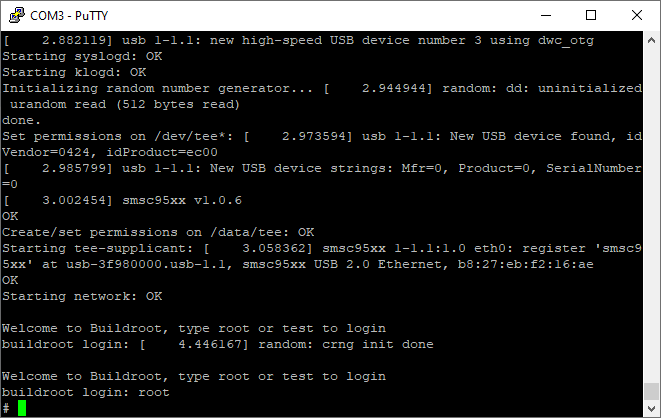

# OPTEE on Rpi3 hardware 

**FOR STUDENTS WHO WANT TO EXPERIMENT REAL HARDWARE. **

**If you are unsure, use QEMU. See [here](quickerstart.md)** 


Read the instructions for QEMU [here](quickerstart.md). will follow a similar procedure with minor tweaks. 

**Grab source.** Note that we point to `rpi3.xml` instead of `qemu_v8.xml`: 

```sh
$ mkdir -p ~/bin
$ curl https://storage.googleapis.com/git-repo-downloads/repo > ~/bin/repo && chmod a+x ~/bin/repo
$ export PATH=~/bin:$PATH
$ mkdir optee-rpi3 && cd optee-rpi3 && \
  repo init -q -u https://github.com/OP-TEE/manifest.git -m rpi3.xml -b 3.9.0 && \
  repo sync -j4 --no-clone-bundle
```

**Build:** 

```bash
$ cd build
$ make -j2 toolchains
$ make -j`nproc` # note we don't need flags for VIRTFS, etc.
```

The build output will be `out-br/images/rootfs` which is the filesystem tree (and image) for Rpi3. 

**Prepare the SD card:**

In the following steps, we will load the filesystem tree to a microSD card. OPTEE's [instructions](https://optee.readthedocs.io/en/latest/building/devices/rpi3.html) for Rpi3 suggest you to go `build/` and run `make img-help` to see the list of commands. Here is a [sample output](../rpi3-flash-sample-cmd.txt) from my computer; you should follow the commands displayed when you rum `make img-help` on your computer. 

These commands are nothing magical: 

i) format a microSD card from scratch. The commands use `fdisk` to create two partitions: boot (32MB, FAT32) and rootfs (spanning the rest of the microSD card, ext4). 

ii) load the filesystem image to the card. The commands extract boot/ and / from the filesystem image (*.cpio) to the two partitions of the microSD card, respectively. 

**Note:** these commands assume that you have a local Linux machine, to which you can plug in the micro SD card (via a card reader) and partition it. What if you only have a Windows or Mac machine? I think you can use WSL/Win32DiskImager for the former and diskutil on the latter. Some ref [here](https://www.raspberrypi.org/documentation/installation/installing-images/mac.md). I haven't tried either. You can tell me your findings. 

**Boot Rpi3 from the micro SD card:**

Power on Rpi3 and hook up a serial cable. We boot into a Linux console (root, empty password) from a serial console: 



Then we can validate that OPTEE works by running the xtest suite. Hooray! :grin:

Note: Both the normal and the secure worlds share the same console. Secure world has higher privilege and its output will overwrite that of the normal world. 


Reference: [here](https://github.com/piachristel/open-source-fabric-optee-chaincode/blob/master/documentation/chaincode-and-chaincode-proxy-rapi.md) and [here](https://optee.readthedocs.io/en/latest/building/gits/build.html)