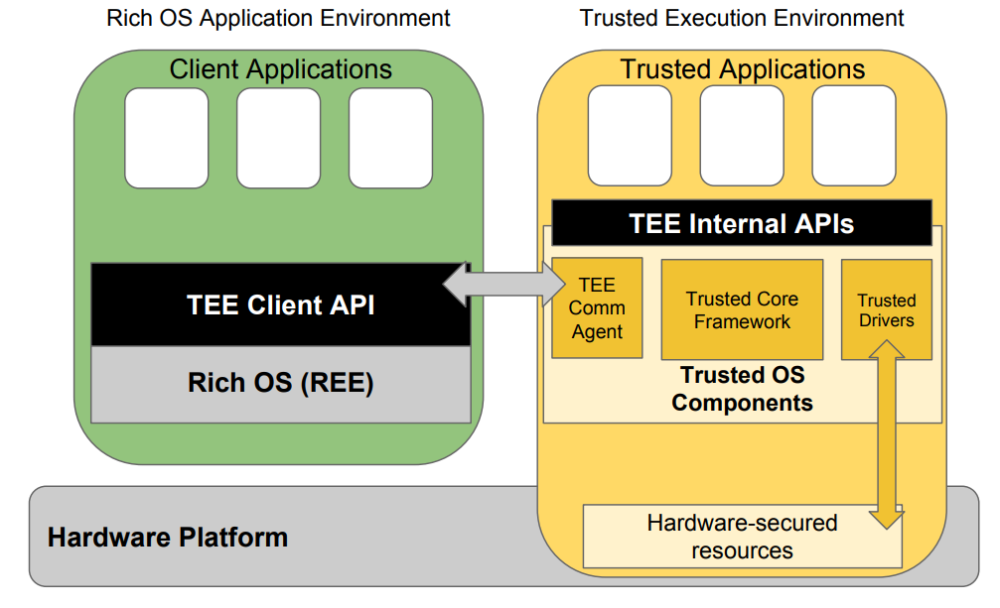
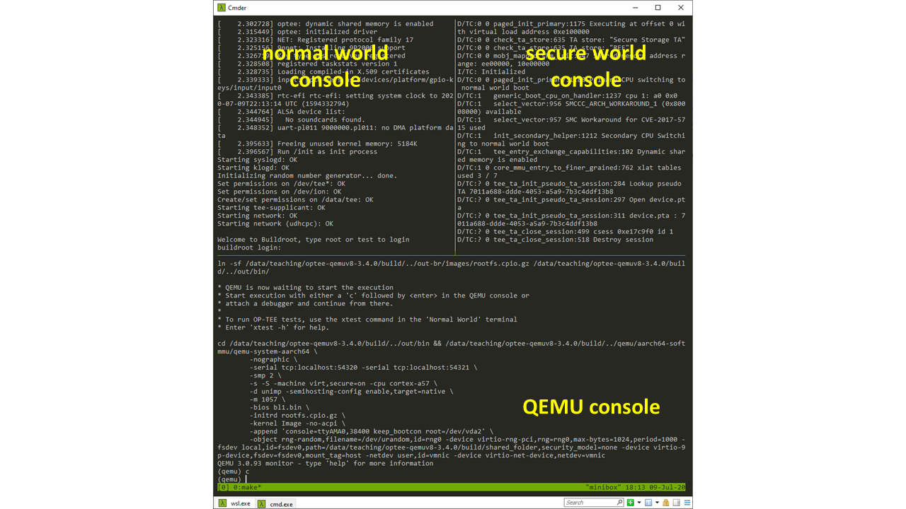
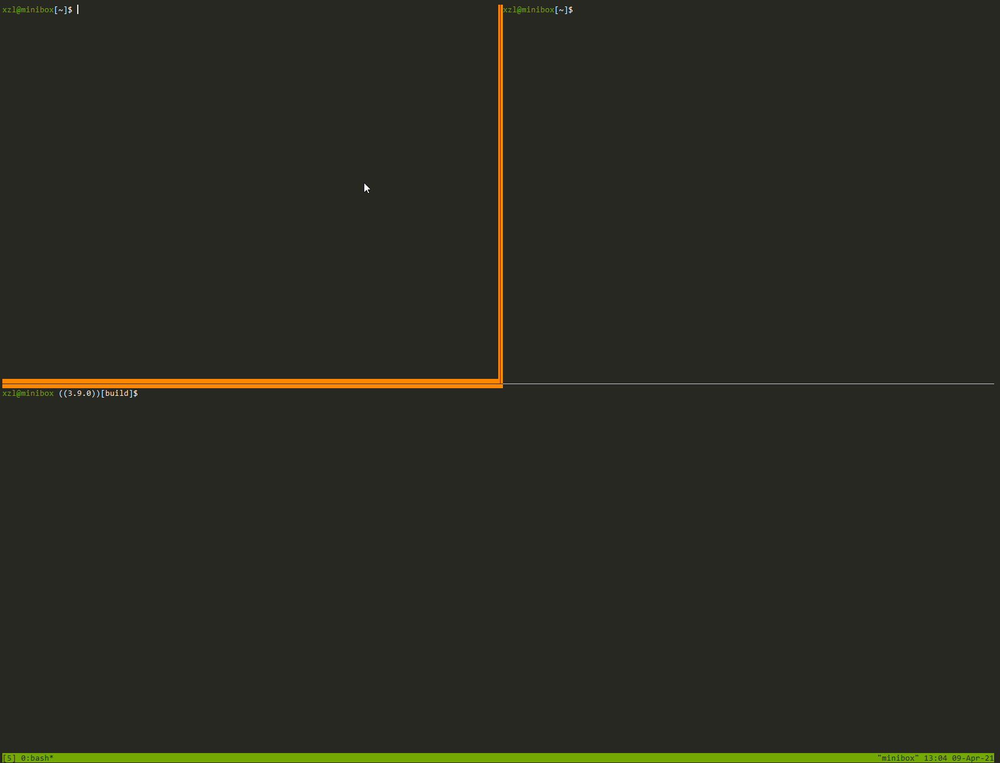
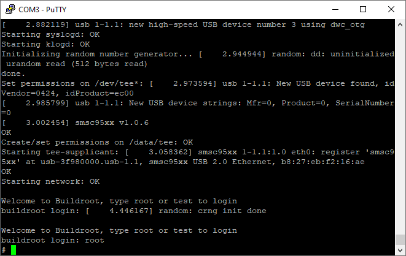
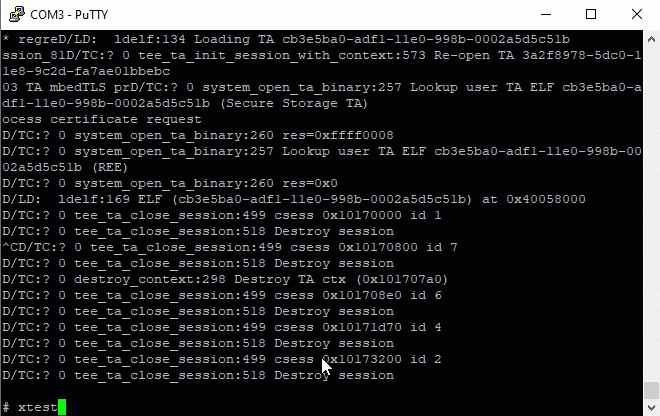

# Quickstart: OPTEE 

**This project is to be completed on granger1/2 or rpi3**

## Source code overview

Compared to the codebase we have dealt with before, OPTEE is a complex project with a myriad of components, including QEMU, a normal world daemon, trustlets (TAs), etc. The sources of all these components are organized in a directory with the following structure. 

```
($optee ROOT)
├── build (this is where we execute the build command)
	├── shared_folder/ (will be shared with the QEMU)
	├── (other artifacts)
├── buildroot
├── edk2 (a firmware SDK)
├── linux
├── mbedtls
├── optee_benchmark
├── optee_client
├── optee_examples
├── optee_os
├── optee_test
├── out
├── out-br (the build outcome)
├── qemu (a qemu version with TrustZone support)
├── soc_term
├── toolchains
└── trusted-firmware-a
```

Each component is versioned in its own git repository. Together, all these git repositories are managed (e.g. pull, push) by a tool called `repo`.  

> `repo` is a by-product of Google's AOSP project. 

The build process is complex, e.g. managed by numerous Makefiles in a hierarchy, let alone building for a series of targets, e.g. various Arm boards and QEMU. To automate the build process, there is a dedicated component called `build` (see above), which has its own git repository! 

### Building the project: an overview

1. Install tools & libs required for building
2. Pull the source of the entire project via `repo`. 
3. First time build: we will build everything including QEMU and normal/secure worlds binaries of OPTEE. The build process will pack these binaries into an Armv8 system image (rootfs image) to be launched by QEMU
4. Run QEMU and play with "Hello world", validating that our environment works properly.
5. Repeated build: modify source code of normal world app and TAs, and build again. 

Read on for detailed steps below. 

### Terms
**TA** Trusted applications, sometimes called trustlets. A TA is a binary to be executed in the secure world. 

**CA** Trusted clients, or clients. A TA is a normal world apps invoking TAs. 

**TEE supplicant**: the OPTEE daemon running in the normal world serving clients 

**Host vs guest** The lingo of OPTEE source refers the normal world app as "host". Be aware though: in the context of virtual machines, the PC/server where we hack & develop OPTEE code is "host" and QEMU is a "guest". We will be explicit in differentiating them. 




## Setup steps

You can choose one of two possible environments: an ARM platform with TrustZone as emulated by QEMU; Rpi3 with has TrustZone built in. 

*NOTE: you cannot reuse QEMU from p1!*

### Alternative environment 1: QEMU

To run examples on the QEMU ARMv8 emulator, we need first build OP-TEE for QEMU that emulates ARMv8 and TrustZone. 

*For students run QEMU on personal machines not the server:* (Note: use granger1/2 is easier for most students) You can install dependencies with this [instruction](https://optee.readthedocs.io/en/latest/building/prerequisites.html). If the installation fails, e.g. due to unmet dependency, it's likely that the source of your apt repository is not properly configured. A common cause is that you have previously installed packages from some third-party apt sources. Remove them from /etc/apt and do `apt update`. 

Download the OPTEE source. We use version 3.9. 

```sh
$ mkdir -p ~/bin
$ curl https://storage.googleapis.com/git-repo-downloads/repo > ~/bin/repo && chmod a+x ~/bin/repo
$ export PATH=~/bin:$PATH
$ mkdir optee-qemuv8 && cd optee-qemuv8 && \
  repo init -q -u https://github.com/OP-TEE/manifest.git -m qemu_v8.xml -b 3.9.0 
```

Now modify `.repo/manifests/qemu_v8.xml`, change the following line. [Explanation](issues.md)

```
- <project path="linux"  name="linaro-swg/linux.git" revision="optee" clone-depth="1" />
+ <project path="linux"  name="linaro-swg/linux.git" revision="refs/tags/optee-3.10.0" clone-depth="1" />
```

Now fetch all the code: 
```sh  
  repo sync -j4 --no-clone-bundle
```

[Sample command output](repo-output.md)

>
> In case you are curious, the .xml file lists all the git repos and the corresponding commits that we refer to. Check it out: https://github.com/ForgeRock/optee-manifest/blob/master/qemu_v8.xml

Build OPTEE for QEMU ARMv8: 

```sh
$ cd build
$ make -j2 toolchains
# clean build: about 5 minutes on a 20-core machine
$ make QEMU_VIRTFS_ENABLE=y CFG_TEE_RAM_VA_SIZE=0x00300000 -j `nproc`
```

Additional notes on cleaning up OPTEE build: [here](cleanup.md) 

#### Adjust the makefile  `qemu_v8.mk`

```
diff --git a/qemu_v8.mk b/qemu_v8.mk
index 8271590..1c4a91b 100644
--- a/qemu_v8.mk
+++ b/qemu_v8.mk
@@ -163,9 +163,9 @@ run-only:
        ln -sf $(ROOT)/out-br/images/rootfs.cpio.gz $(BINARIES_PATH)/
        $(call check-terminal)
        $(call run-help)
-       $(call launch-terminal,54320,"Normal World")
-       $(call launch-terminal,54321,"Secure World")
-       $(call wait-for-ports,54320,54321)
+       # $(call launch-terminal,54320,"Normal World")
+       # $(call launch-terminal,54321,"Secure World")
+       # $(call wait-for-ports,54320,54321)
        cd $(BINARIES_PATH) && $(QEMU_PATH)/aarch64-softmmu/qemu-system-aarch64 \
                -nographic \
                -serial tcp:localhost:54320 -serial tcp:localhost:54321 \
                -smp $(QEMU_SMP) \
-               -s -S -machine virt,secure=on -cpu cortex-a57 \
+               -S -machine virt,secure=on -cpu cortex-a57 \
```

Explanation: the three changed lines launch local terminal emulators (e.g. xterm). These are useful only when you are developing on your local Linux machine. They do not apply when you connect to a remote server over SSH. So comment out if you use granger1/2.

The last line specifies -s, which tells QEMU to listen for incoming GDB connection. The listened port is 1234. If multiple students try to do the same thing, their commands will fail because only one student can bind to port 1234. 

#### Run netcat (nc)

Run two `nc` to listen port `54320` and `54321`, which connect to consoles for normal & secure worlds of the ARM system emulated by QEMU, respectively. 

```
$ nc -l 127.0.0.1 54320
$ nc -l 127.0.0.1 54321
```

NOTE on nc: 

1. nc has slight variations in its command line syntax. If you run into issues, see [here](https://serverfault.com/questions/512333/how-can-i-configure-netcat-or-some-other-stock-linux-utility-to-listen-on-a-sp). 
2. Apparently on the same server you cannot use the same ports, e.g. 54320/54321, being used by other students. Just pick your own "personal" ports. Set them up in **qemu_v8.mk** above and your **command lines**. 

#### Run QEMU

```sh
$ make run-only 
```

Once QEMU is launched, start the emulated guest by typing `c`.

Here is my window (running tmux) split in three ways: 





### Alternative environment 2: Rpi3

Read the instructions for QEMU above. We will follow a similar procedure with minor tweaks. 

**Grab source.** Note that we point to `rpi3.xml` instead of `qemu_v8.xml`: 

```sh
$ mkdir -p ~/bin
$ curl https://storage.googleapis.com/git-repo-downloads/repo > ~/bin/repo && chmod a+x ~/bin/repo
$ export PATH=~/bin:$PATH
$ mkdir optee-rpi3 && cd optee-rpi3 && \
  repo init -q -u https://github.com/OP-TEE/manifest.git -m rpi3.xml -b 3.9.0 && \
  repo sync -j4 --no-clone-bundle
```

**Build:** 

```bash
$ cd build
$ make -j2 toolchains
$ make -j `nproc` # note we don't need flags for VIRTFS, etc.
```

The build output will be `out-br/images/rootfs` which is the filesystem tree (and image) for Rpi3. 

**Prepare the SD card:**

In the following steps, we will load the filesystem tree to a microSD card. OPTEE's [instructions](https://optee.readthedocs.io/en/latest/building/devices/rpi3.html) for Rpi3 suggest you to go `build/` and run `make img-help` to see the list of commands. Here is a [sample output](../rpi3-flash-sample-cmd.txt) from my computer; you should follow the commands displayed when you rum `make img-help` on your computer. 

These commands are nothing magical: 

i) format a microSD card from scratch. The commands use `fdisk` to create two partitions: boot (32MB, FAT32) and rootfs (spanning the rest of the microSD card, ext4). 

ii) load the filesystem image to the card. The commands extract boot/ and / from the filesystem image (*.cpio) to the two partitions of the microSD card, respectively. 

**Note:** these commands assume that you have a local Linux machine, to which you can plug in the micro SD card (via a card reader) and partition it. What if you only have a Windows or Mac machine? I think you can use WSL/Win32DiskImager for the former and diskutil on the latter. Some ref [here](https://www.raspberrypi.org/documentation/installation/installing-images/mac.md). I haven't tried either. You can tell me your findings. 

**Boot Rpi3 from the micro SD card:**

Power on Rpi3 and hook up a serial cable. We boot into a Linux console (root, empty password) from a serial console: 



Then we can validate that OPTEE works by running the xtest suite. Hooray! :grin:



Reference: [here](https://github.com/piachristel/open-source-fabric-optee-chaincode/blob/master/documentation/chaincode-and-chaincode-proxy-rapi.md) and [here](https://optee.readthedocs.io/en/latest/building/gits/build.html)

## Test apps

Verify that OPTEE's normal-world daemon (`tee_supplicant`) is already started automatically as a service. In the normal world console: 
```
$ ps aux|grep supplicant
 190 tee      /usr/sbin/tee-supplicant -d /dev/teepriv0
```

Run OPTEE's test suite (`xtest`), which should have already been baked in the rootfs image in the build process: 

```
$ which xtest
/usr/bin/xtest
$ xtest
(output...)
```
For more options for `xtest`, see its [reference](https://optee.readthedocs.io/en/latest/building/gits/optee_test.html#optee-test-run-xtest)

Now try examples for OPTEE, e.g. 

```
$ optee_example_hello_world
Invoking TA to increment 42
TA incremented value to 43
```

Reference: [Official build instructions](https://optee.readthedocs.io/en/latest/building/gits/build.html#root-fs)

## Development workflow

### Alternative 1: the easiest way (need to reboot QEMU every time)

We will leverage an existing OPTEE example program: modify/add/delete its sources, rebuild the entire rootfs, and relaunch QEMU. In this way, we do not have deal with the Makefile hierarchy. 

We pick the "helloworld" example. Here's its source directory: 

``` bash
$ tree ./optee_examples/hello_world/
hello_world/
├── Android.mk
├── CMakeLists.txt
├── host (the normal world)
│   ├── main.c
│   └── Makefile
├── Makefile
└── ta (the secure world)
    ├── Android.mk
    ├── hello_world_ta.c
    ├── include
    │   └── hello_world_ta.h
    ├── Makefile
    ├── sub.mk
    └── user_ta_header_defines.h
3 directories, 11 files

```

#### CA (the normal world): 

Let's do some trivial changes to the helloworld app source: 

./optee_examples/hello_world/host/main.c

```
@@ -82,7 +82,7 @@ int main(void)
         * TA_HELLO_WORLD_CMD_INC_VALUE is the actual function in the TA to be
         * called.
         */
-       printf("Invoking TA to increment %d\n", op.params[0].value.a);
+       printf("hello! ... Invoking TA to increment %d\n", op.params[0].value.a);
+       
```

Then rebulid hello world: 
```
$ cd build    
$ make buildroot
```
> Note that `make optee-examples-common` seems obsoleted. See [discussion](https://github.com/OP-TEE/build/issues/282).

The target will be at `./out-br/target/usr/bin/optee_example_hello_world`.

Restart QEMU and invoke the CA  from within QEMU, showing that our modification is effective: 

```
# in the normal world console 
$ optee_example_hello_world
hello! ... Invoking TA to increment 42
TA incremented value to 43
```

#### TA (the secure world)
./optee_examples/hello_world/ta/hello_world_ta.c. Again, do some trivial changes: 
```
@@ -108,7 +108,8 @@ static TEE_Result inc_value(uint32_t param_types,
                return TEE_ERROR_BAD_PARAMETERS;

        IMSG("Got value: %u from NW", params[0].value.a);
-       params[0].value.a++;
+       params[0].value.a+=2;
        IMSG("Increase value to: %u", params[0].value.a);
```

Build: 
```
$ cd build    
$ make buildroot
```

Check the build outcome: 
```
$ ls -lh out-br/target/lib/optee_armtz/8aaaf200-2450-11e4-abe2-0002a5d5c51b.ta
-r--r--r-- 1 xzl xzl 55K Jul 10 09:56 out-br/target/lib/optee_armtz/8aaaf200-2450-11e4-abe2-0002a5d5c51b.ta

$ md5sum out-br/target/lib/optee_armtz/8aaaf200-2450-11e4-abe2-0002a5d5c51b.ta
669e219e7381c842d80f3ba68db9368f  out-br/target/lib/optee_armtz/8aaaf200-2450-11e4-abe2-0002a5d5c51b.ta
```
Why the magic filename? This is because each TA is named after a unique UUID. In this example, it is defined in `hello_world_ta.h`. The build script will pick the UUID up and name the output binary after it. 

Restart QEMU, and check if the newly build TA is baked into our rootfs: 

```
# QEMU's normal world console: 
$ md5sum /lib/optee_armtz/8aaaf200-2450-11e4-abe2-0002a5d5c51b.ta
669e219e7381c842d80f3ba68db9368f
```

Now run helloworld again: 

```
# in QEMU's normal world console 
$ optee_example_hello_world
hello! ... Invoking TA to increment 42
TA incremented value to 44
```

The value is incremented by 2 -- our modification to TA works!

### Alternative 2: A better way (shared binaries with QEMU, no reboot needed)

With the above method, you will soon find it tedious to restart QEMU every time we change TA/CA sources. The solution is to share the TA/CA build outcome via a folder shared with the QEMU guest.

On the development machine, from the OPTEE root: 

```sh
$ mkdir build/shared_folder
```
When we build & launch QEMU, pass in "VIRTFS" (virtual filesystem) arguments: 
```
$ make run-only QEMU_VIRTFS_ENABLE=y QEMU_VIRTFS_HOST_DIR=build/shared_folder
```
Update (04/12/2021): if the above command complains "shared_folder" not found, try its full path, or 

```
$ make run-only QEMU_VIRTFS_ENABLE=y QEMU_VIRTFS_HOST_DIR=../../build/shared_folder/
```


After QEMU is launched, mount the shared folder in QEMU guest system (username: root).

```sh
# inside the QEMU's normal world console
# this creates /root/shared/ which will be mapped to the host's build/shared_folder
$ mkdir shared && mount -t 9p -o trans=virtio host shared
```


Every time we rebuild a CA, copy its binary to the shared directory: 

```
$ cp ./out-br/target/usr/bin/optee_example_hello_world build/shared_folder/
```

If we rebuild a TA, first copy TAs to the shared directory; then from within QEMU copy the TAs to the guest's `/lib` where OPTEE's daemon will look for TAs: 

```sh
# from QEMU's normal world console: 
$ cd shared && cp *.ta /lib/optee_armtz/
```
Of course, you should write a script to automate the above workflow! 

Need extra software packages (e.g. strace) to be included in the rootfs image? either change `common.mk` or `out-br/.config` (may be overwritten). See [here](https://github.com/OP-TEE/optee_os/issues/2632). 

### Alternative 3: Rpi3: copying files over SSH

If we are running Rpi3, we copy over CA/TA over SSH connection. [This article](https://github.com/piachristel/open-source-fabric-optee-chaincode/blob/master/documentation/chaincode-and-chaincode-proxy-rapi.md) explains how to quickly configure an SSH server on Rpi3. 
