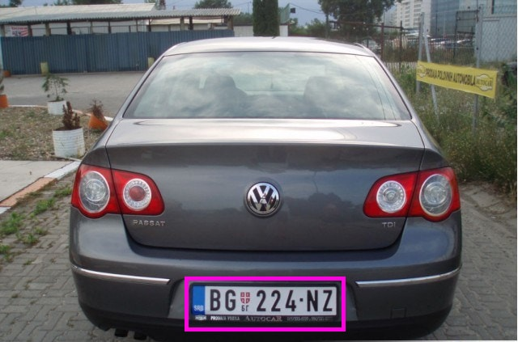

# Experiment: secure vision 

*Mar/2023: updated based on boilerplate code.*

We will run a computer vision service in the secure world. This is useful when we want to ensure the confidentiality of the input data and also the integrity of the service code in the face of the untrusted normal world.  

[TOC]

## Task overview

We will create a TA that accepts **encrypted** images (in jpg) submitted from the CA. The TA will run license plate detection service on the input images; for each detected license plate on the image, the TA will return the results, e.g. coordinates of its bounding boxes. 

## Design choices

### The CA/TA interface

The basic interactions can be learnt from example 1 (helloworld). Passing image data (large chunks, variable length) in/out can be learnt from example 2 (secure data path) . **Note**: the sdp example uses a CA-allocated shared buffer, which requires the TA to be compiled with the TA_FLAG_SECURE_DATA_PATH flag ([discussion](https://github.com/OP-TEE/optee_os/issues/4572)); yet this is optional in order to implement the challenge -- the TA can allocate a secure world buffer for storing incoming data. 

You will come up with the command(s) and the formats of parameters passed in/out of the secure world. 

#### Computer vision library for TEE

We need to run code inside the TA for image decoding and simple vision algorithms. On one hand, we do not want to reinvent the wheel. On the other hand, we cannot use popular frameworks such as Tensorflow or nCNN. Why? Optimized for speed and rich features, they are large and have extensive external dependency. Porting them to the secure world will be tedious, if not impossible. Furthermore, we are limited to libraries implemented in C as OPTEE does not have libs and runtimes, e.g. for C++ or Python. 

Indeed, we are looking for an "embedded" library that is lightweight, self-sufficient, and in C. To this end, SOD seems a good choice. It provides simple sample programs and good documentation. 

https://sod.pixlab.io/intro.html

For those who wish to use the SOD library, we have ported the library to the secure world. The library source is included in the boilerplate that we give to you. 

#### Cryptos

We will choose the encryption/decryption algorithm used by the normal/secure worlds. Consider: 

1. Symmetric or asymmetric? Two families of crypto schema are at our hand: symmetric and asymmetric. The former uses only ***one*** key for both  encryption and decryption while the latter uses a public/private key pair: ***public*** key for encryption and ***private*** key for decryption. The choice of these cryptos lead to different performance overhead. 
2. Are there existing implementations for the crypto? 
3. How would we store the crypto key in the secure world? 

We recommend AES, for which OPTEE implements APIs. Example code: `optee_examples/aes/`. The example has both the CA and the TA code. To try out the example. 

In the normal world,  do: 

Secure world console: 

**To implement your own CA:** we will give you Python code that encrypts given images with AES. In this way, your CA only needs to load the encrypted images and send to the secure world for processing. 

## The artifacts we give to you: 
* Boilerplate code of TA, which should be copied to optee_examples/. 
* A Python program for encrypting images and decrypting images
## You develop: 
* TA
* CA
* Any scripts you need to automate your development and test

## Reason about security

Each design decision you made above is crucial to the security of the system. Consider the following questions: 

* With your design of CA/TA interface, what could normal world learn at best? Does this affect the design goal of your system? 
* What is the implication of accepting user-input images and run algorithms on them inside secure world? Is the system safe for good by putting the security sensitive code inside secure world?
* With your choice of crypto, what additional assumptions you **must** make to ensure security? Hints: 
  * Symmetric encryption uses only one key. Can you expose it to normal world? If you have to do so to encrypt images, what assumption you must make to ensure the images are still confidential?  
  * How do you store the key(s)? Can you bake them into TA and why?   

