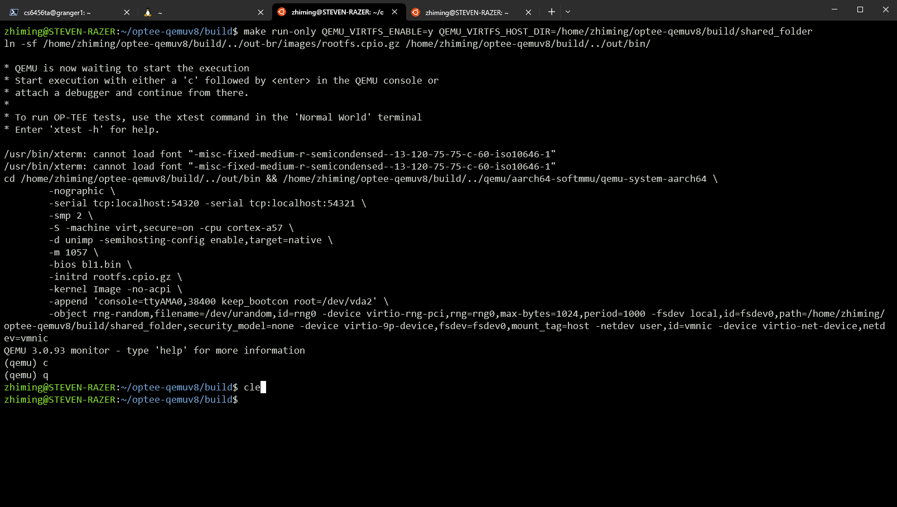
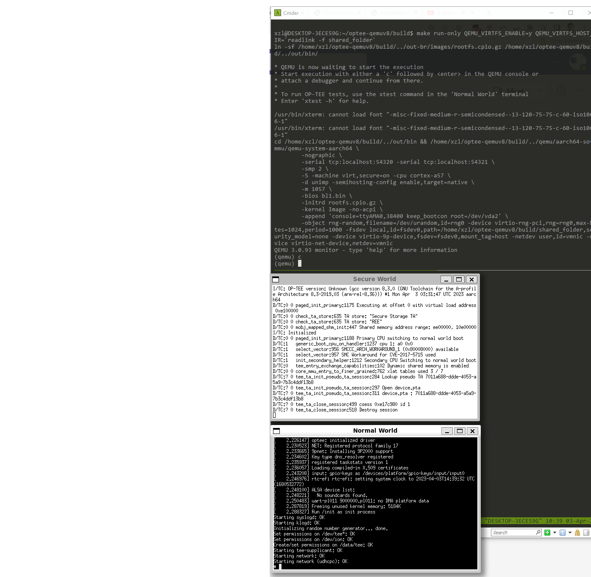

# Build OPTEE on Windows Subsystem for Linux (WSL)

### Recommended System Specs

- Up-to-date Windows version. Windows 10 Pro (or similar) 21H2 and newer
- 4 or more core processor
- 8G or more system memory, 50G or more free disk space

### Install WSL

Make sure do WSL2, not WSL1. Install in one of the following ways

- Follow [Microsoft's installation guide](https://learn.microsoft.com/en-us/windows/wsl/install)
- Open Microsft Store in Windows (Windows' App Store), search "Windows Subsystem for Linux" and click on "Install". The direct link is [here](https://www.microsoft.com/store/productId/9P9TQF7MRM4R)

### Install Ubuntu 20.04 LTS

#### Install through command line in Powershell

- Can list all available distros
  ```
  wsl --list --online
  ```
- Then install Ubuntu 20.04
  ```
  wsl --install Ubuntu-20.04
  ```
- If see an error at the end of installation, try
  ```
  wsl --update
  ```
- To list installed distros
  ```
  wsl --list
  ```
- To set the default distro for wsl, do
  ```
  wsl -s Ubuntu-20.04
  ```

#### Install through Microsoft Store

Search for "Ubuntu 20.04" in the store and click on Install. The direct link is [here](https://www.microsoft.com/store/productId/9MTTCL66CPXJ)

### Launch and check version 

```
bash

$ lsb_release -a
xzl@DESKTOP-3ECE59G:/mnt/c/Users/xl6yq$ lsb_release -a
No LSB modules are available.
Distributor ID: Ubuntu
Description:    Ubuntu 20.04.3 LTS
Release:        20.04
Codename:       focal

```

### Install OPTEE Dependencies

Install all the softwares listed on [OPTEE doc](https://optee.readthedocs.io/en/latest/building/prerequisites.html), in the tab corresponding to Ubuntu 20.04. Run the following two commands on WSL Ubuntu terminal.

```
$ sudo apt update
$ sudo apt install \
  android-tools-adb \
  android-tools-fastboot \
  autoconf \
  automake \
  bc \
  bison \
  build-essential \
  ccache \
  cscope \
  curl \
  device-tree-compiler \
  expect \
  flex \
  ftp-upload \
  gdisk \
  iasl \
  libattr1-dev \
  libcap-dev \
  libfdt-dev \
  libftdi-dev \
  libglib2.0-dev \
  libgmp3-dev \
  libhidapi-dev \
  libmpc-dev \
  libncurses5-dev \
  libpixman-1-dev \
  libssl-dev \
  libtool \
  make \
  mtools \
  netcat \
  ninja-build \
  python3-crypto \
  python3-cryptography \
  python3-pip \
  python3-pyelftools \
  python3-serial \
  rsync \
  unzip \
  uuid-dev \
  xdg-utils \
  xterm \
  xz-utils \
  zlib1g-dev
```

An important thing here is that after installing the softwares, the name `python` should be recognized as `python2`. Manually install `python2` may be needed.

### Build opteev8-qemu 

As usual... Check [troubleshoot](issues.md) if needed.

### Run 

#### Xterms
x11 apps (graphics) should work out of box on WSL2+Win10. You shouldn't need any extra packages such as x11 servers (Xming etc). To test it, do 
```
(WSL) xterm
```
(apt install any missing packages as prompted)

(04/2023) Works on Win 10 Enterprise 22H2; not working on Win 10 Education 21H2 which may need some elbow grease (manual tweak xserver, etc)

If above works, you can auto launch normal/secure worlds in their separate xterms, in one command line. 

Uncomment the three lines in build/Makefile. Note the ports
```
	  $(call launch-terminal,54320,"Normal World")
	  $(call launch-terminal,54321,"Secure World")
	  $(call wait-for-ports,54320,54321)
```

Then launch it as usual, e.g.  (MUST CHANGE ARGUMENTS AS NEEDED)
```
make run-only QEMU_VIRTFS_ENABLE=y QEMU_VIRTFS_HOST_DIR=`readlink -f shared_folder`
```

#### Final results 
Screenshot 1 (Zhiming Xu)


Screenshot 2 (FL)

