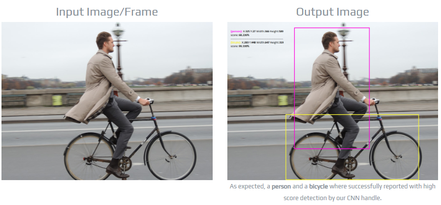

# Experiment: A secure machine learning service

We will run a machine learning service in the secure world. This is useful when we do not want to expose the input data or the machine learning model to the normal world, deeming it untrusted. 

We will create a TA that accepts **encrypted** images (in jpg) submitted from the CA. The TA will run neural network inference on the input image; for each detected object on the image, the TA will return the coordinates of its bounding boxes, and a textual label (e.g. "bicycle"). 

## Challenges

### CA/TA interface

The basic interaction flow can be learnt from the helloworld example. Passing image data is (large chunks, variable length) in/out can be learnt from the sdp (secure data path) example. 

You will come up with the command(s) and the formats of parameters passed in/out of the secure world. 

### Shopping for proper libraries

We need to run code inside the TA for image decoding and NN inference. On one hand, we do not want to reinvent the wheel. On the other hand, we cannot use popular frameworks such as Tensorflow or nCNN. Optimized for speed and rich features, they are large and have extensive external dependency. Porting them to the secure world will be tedious. Furthermore, we are limited to libraries implemented in C as OPTEE does not have libs and runtimes, e.g. for C++ or Python. 

Indeed, we are looking for a "embedded" library that is lightweight, self-sufficient, and in C. To this end, SOD seems a good choice. It provides a simple program and good documentation. 

https://sod.pixlab.io/intro.html#cnn

You should feel free to pick your choice of libs. 

See the general [porting guide](porting.md) for porting libraries/apps into TrustZone.

### The choice of crypto algorithms
What encryption/decryption algorithm do you plan to use? Are there existing implementations for OPTEE and Linux in the normal world? 

### Key management

How do you plan to distribute the crypto keys to the secure/normal worlds?

How to store the keys securely? Are there existing support in OPTEE? 

### Secure storage

The NN model shall be kept in secure world only. To do that, you will need to study OPTEE's secure storage. 

## Deliverables

Demonstrate that your code works. 

Report performance measurement. 

Enhancement ideas: can you use multicore to speedup the inference? 

